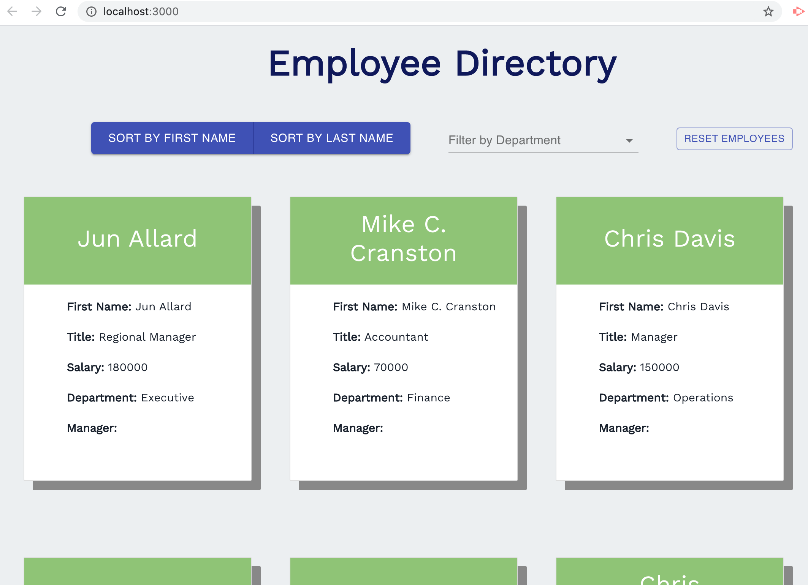

# Employee Directory

This is an employee directory with React. This assignment will require you to break up your application's UI into components, manage component state, and respond to user events.

